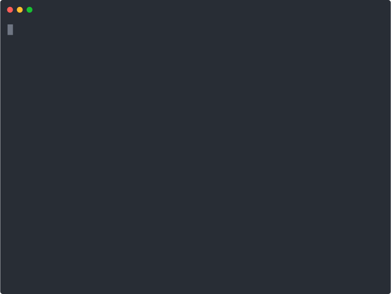

## Overview
So you've finished (or are moments away from finishing) the SE Jumpstart course. What should you do now? Everyone comes to this course with different goals, but if one of your goals is to continue learning more about Python and software development, here are a few things that we recommend learning about.

## Nothing
Well, it's not really *nothing*, but Python does have a special datatype to handle the cases where it has to provide *something* but there isn't *anything* to provide. It's called `None` which is a `NoneType`. You might see this show up unexpectedly, and there are some situations where you may intentionally want to set the value of a variable to `None`. Knowing what it is and how to avoid it if you didn't intend to use it is valuable.

**More Reading:** [What Is None](what-is-none.md)

## Dictionaries
We are not talking about extending the [Vocabulary Word](../session3/classroom/exercise_vocabulary.md) exercise here. A dictionary (or `dict`) is a special datatype in Python that's also known as a "key/value" or a "hash table" or "hash map". Different programming languages have different syntax, but the idea is the same.

Thinking back to the [Session 4 Lightning Exercise](../session4/classroom/lightning_exercises.md), if we also wanted to keep track of the size of the drink that the customer has ordered we could do something like this:

```python
customer_name = "Mocha Joe"
customer_order = "mocha"
drink_size = "super large"
```

This approach is fine, but it also means we have more variables to keep track of, not to mention that if we later decide we want to track the price, or quantity, or any extra instructions we'd have to keep adding more variables.

A dictionary would allow us to create a single variable with multiple "keys" (e.g. `customer_name`, `customer_order`) with associated values (e.g. "Mocha Joe", "mocha"), giving us a single variable to work with.

```python
customer_order = {
    "customer_name": "Mocha Joe",
    "customer_drink": "mocha",
    "drink_size": "super large"
}

print(customer_order["customer_name"] + " ordered a " + customer_order["customer_drink"])
```

**More Reading:** [Manage data with Python dictionaries](https://docs.microsoft.com/en-us/learn/modules/python-dictionaries/)

## String Formatting
We've done some very basic string formatting in the course. We've used the `+` sign to concatenate (join) strings, and we've used the `str()` function to print numbers. Python includes several ways to format strings that are much more powerful than these approaches.

One of the easiest ways to format strings is with something called "f-strings". You can use them in `print()` statements or when you are assigning values to other variables. Simply add an `f` before the first quote (`"`), and then include any variables you want to print by wrapping them in a pair of curly braces (`{}`).

```python
name = "Joe"
die_roll = 5

# using the + sign and str() method:
print("Hello " + name + " - you rolled a " + str(die_roll) + "!")

# using an f-string
print(f"Hello {name} - you rolled a {die_roll}!")

# assigning to a variable
output_string = f"{name} rolled a {die_roll}"
```

You'll note that we didn't have to include the `str()` function for our integer variable when using the f-string - very nice!

**More Reading:** [String format in Python](https://docs.microsoft.com/en-us/learn/modules/python-strings/5-string-format)

## String Methods
In addition to being able to easily format strings, Python includes a variety of functions to perform commonly needed tasks. For example, converting a string to all lower case, or all UPPER CASE, or checking to see if a string contains numbers, or replacing certain characters in a string. Most of these methods can be called on any string variable. Here are just a few examples:

```python
mystring = " Hello World, this is a fun string!  "

# convert to lowercase
lower_string = mystring.lower()

# convert to UPPERCASE
upper_string = mystring.upper()

# Convert To Title Case
title_string = mystring.title()

# remove leading and trailing spaces
stripped_string = mystring.strip()

# check to see if this string is a number
is_this_a_number = mystring.isdigit()
```

> **TIP:** Python has long had a philosophy of "batteries included" - meaning that there is a lot of great functionality built into the language. String manipulation is no exception to this rule - if you find yourself needing to do something with strings in Python, chances are there are some methods that will do what you need.

**More Reading:** [String methods in Python](https://docs.microsoft.com/en-us/learn/modules/python-strings/3-string-methods)

## The REPL
REPL stands for "Read-Evaluate-Print-Loop", and is a very powerful tool for writing small bits of Python code quickly. To get into the Python REPL, simply run the command `python3` by itself and you will see a prompt that allows you to write Python. When you are done you can type `exit()` or `quit()` to close the REPL (alternatively on Mac or Linux you can type `Ctrl-D`, or on Windows you can type `Ctrl-Z`).  Here's how we could use the REPL to test out the string methods shown above:



Note that in this example while we are not assigning the results of the different string functions to any variable - we are just running them - we can create variables. Either way we see the output printed directly to the terminal. We can also do math in the REPL!

**More Reading:** [Use the REPL](https://docs.microsoft.com/en-us/learn/modules/intro-to-python/3-repl)

## List Comprehensions
This isn't a funny way to see if you understand lists. List comprehensions are a different syntax for creating new lists from an existing list.  Consider the following 2 snippets, they each produce the same result.

```python
# a list of all our coffee drinks
drink_menu = ["vanilla latte", "caramel latte", "mocha", "cinnamon latte"]

# let's create a list of just the latte drinks
latte_drinks = []
for drink in drink_menu:
    if "latte" in drink:
        latte_drinks.append(drink)

# we can do the same thing like this with one line of code
latte_drinks = [drink for drink in drink_menu if "latte" in drink]
```

> **TIP:** Try copying/pasting some of this code into the REPL and see how it works!

**More Reading:** [Python List Comprehensions](https://www.w3schools.com/python/python_lists_comprehension.asp)

## Classes
While many of you will continue taking classes to keep on learning about programming, that's not what this is about. At this point we have talked (or read) about strings, integers, floating point numbers, boolean, lists, dictionaries, and the `NoneType`. There are even more types that exist in Python, but what if you want to create your own type? This is where classes come in.

Classes are a way of grouping different types of data into a single variable (or "object"). Referring back to the dictionary we created for our customer order above, we might do something like this with classes:

```python
class CustomerOrder():

    def __init__(self, name, drink, size):
        self.customer_name = name
        self.drink = drink
        self.size = size

    def is_latte(self):
        if "latte" in self.drink:
            return True
        else:
            return False

order = CustomerOrder("Mocha Joe", "mocha", "super large")
print(f"{order.customer_name} ordered a {order.size} {order.drink}.")
if order.is_latte == True:
    print("It is a latte")
```

In addition to keeping track of the types of data associated with an order (`customer_name`, `drink`, and `size`), we can create methods that do things with that data (e.g. see if the drink is a latte via the `is_latte` method). There are some things in that example that probably look a little funny - the `__init__` function and the `self` parameter are both things that Python requires when writing classes. We can now create a lot of different orders with this `CustomerOrder` class, and have full confidence that they will all have the same types of data and methods.

The line that defines our order (`order = CustomerOrder("Mocha Joe", "mocha", "super large")`) is referred to as "instantiating an object".

Classes are a key construct used in the type of programming called "object oriented programming". If you go on to the NSS Software Engineering programming, you'll be learning to program with the Java language, which uses classes for nearly everything it does.

**More Reading:** [Introduction to object-oriented programming with Python](https://docs.microsoft.com/en-us/learn/modules/python-object-oriented-programming/)
