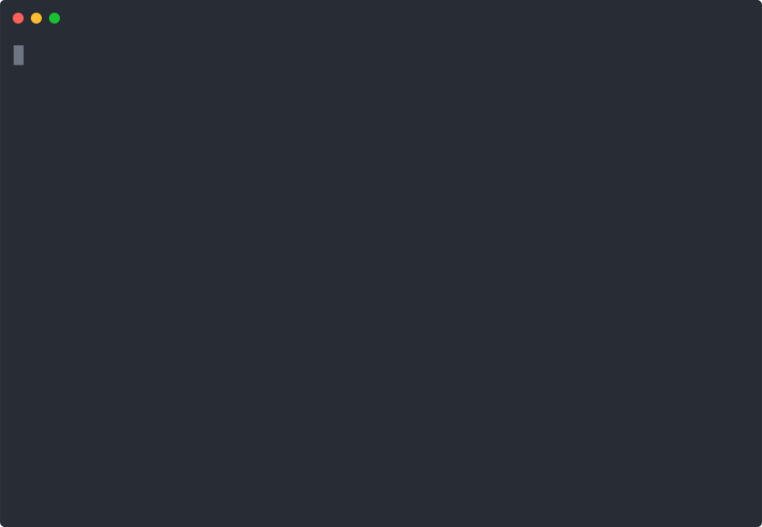

## Datatype Review

We've talked about different [data types](../session4/prework/data_types.md) for our variables. Strings are different than numbers, which are different from Boolean, and then there are more complex types like Lists.

Some examples:

```python
# string (or str)
name = "Joe"

# number (or int)
age = 29

# boolean
drinks_coffee = True

# list
drink_menu = ["espresso", "mocha", "latte"]
```

## Nothing To See Here: A Special Type

You will learn how to use many more types of data as you continue programming, but there's a special type that you may run into unexpectedly called `NoneType`, or the value that represents it: `None`. The value `None` is Python's way of saying "there's nothing here, but I have to have *something*, so I will use `None`". 


## A Quick Example

Consider the following code - trace through it and try to figure out what it's doing before reading ahead.

```python
import random

def compare_numbers(number_one, number_two):
    if number_one == number_two:
        return "match" 

computer_number = random.randint(1,10)
print("The computer is thinking of a number between 1 and 10.")
user_guess = int(input("What number do you think it is? "))

result = compare_numbers(user_guess, computer_number)
print("The computer picked: '" + str(computer_number) + "'")
print("The user guessed: '" + str(user_guess) + "'")
print("These numbers " + result)
```

This uses our friend `random.randint` to pick a number between 1 and 10, then asks the user what number they think the computer picked. It calls the `compare_numbers` function to see if the users guess matches the computers pick; if the two numbers match it returns a string `"match"`. Finally the code prints a quick summary of both numbers, followed by the result that was returned from the `compare_numbers` function.

If we run this code a few times we might see something like this: 



:scream: What happened that second time?! 

## Truly Exceptional Output

Did you see the error message that it printed the second time? It said:

```
TypeError: can only concatenate str (not "NoneType") to str
```

Why did this happen? Let's take a closer look at the code. The `compare_numbers` function returns the string `"match"` if the two numbers match. If they do not match, it does not return anything explicitly, so Python has to return the value `None`.

## Fixer Upper

In order to stop getting this exception, we *could* add a check for `None` like this:

```python

if result != None:
    print("These numbers " + result)
else:
    print("Whoops we got None - I guess the numbers don't match")
```

However, in this case it would be much better to update the function to look something like this:

```python
def compare_numbers(number_one, number_two):
    if number_one == number_two:
        return "match" 
    else:
        return "do not match"
```

Now this function will always return something that we are expecting, and we don't have to worry about checking for `None`.

## None Too Soon

This example is just one way that you may see a `None` / `NoneType` appear while running your code. If you see an error like the one above, go back and double check your code to make sure that you are returning explicit values and aren't just allowing Python to return `None` automatically for you. 

As you continue learning more about programming, you will find that there are some situations where it is advantageous to set a variable to the value `None`, but for the SE Jumpstart course it is sufficient to know that it's something that you may see, and have an idea about how to avoid seeing it.
