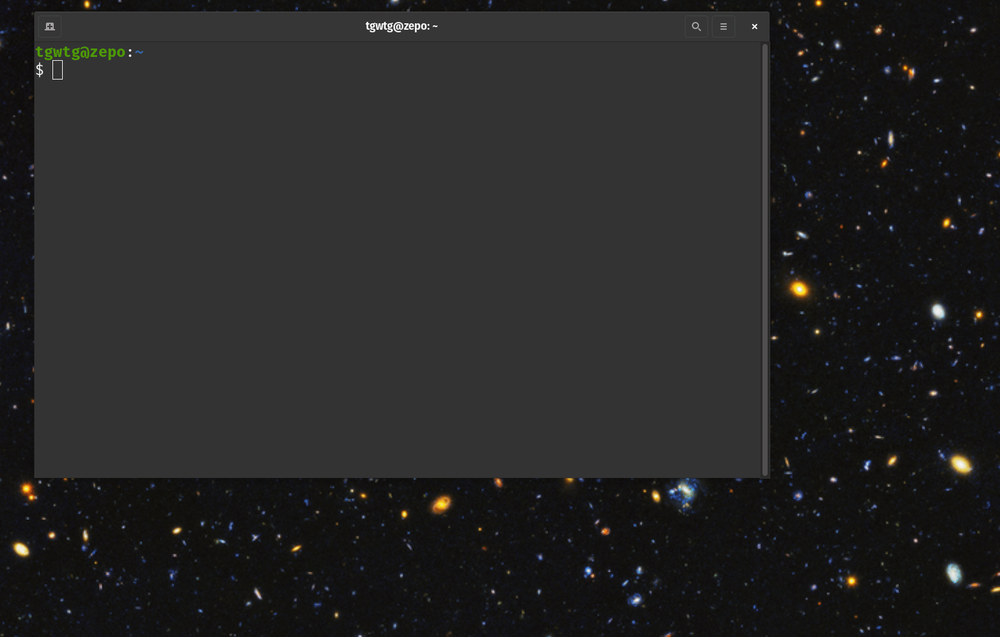

# Let's write some code!

In this lesson you'll write your very first (simple) Python program. Before we get there, though, we've gotta cover a few concepts.

## Code

As we discussed in [What is code, anyway](../prework/what_is_code.md), software is made by stringing together words and symbols in a particular programming language. In short it's written in code.

This might seem pretty obvious, but in order to run _on_ a computer, our code has to be _inside_ the computer. But what does that mean? Where does "live" inside the computer?

## Files

Code _lives_ inside of a file.

Ok. Good. That's settled. Code lives in a file.

So...what's a file?

In the old days when humans needed to remember something, they would write it down...often on paper. Sometimes the information required only a single piece of paper, sometimes it took multiple pieces. Either way this paper with the written information was called a _file_.

> **NOTE:** This writing-things-down technology worked pretty well for several thousand years - right on up through the 20th century. So, you've probably heard of it.

A computer file is much the same as a paper file. It's a mechanism for storing information.

In a computer a file has both _content_ and a _name_. The content is the information stored within the file. The name is a way to identify the file. Often these names contain a word followed by a `.` followed by a two, three or four character _extension_. These file extensions give you a clue as to what kind of content is in the file. Here are a few examples.

| File Name    | Type                           |
| ------------ | ------------------------------ |
| `essay.docx` | Microsoft Word Document        |
| `doggo.jpg`  | An image _(possibly of a dog)_ |
| `script.py`  | A Python source code file      |
| `notes.txt`  | A text file                    |

> **NOTE:** A file containing code is often called a _source file_ _(remember code is also called "source code")_, or it's named after the code's programming language. For example, a _Python file_ contains _Python code_.

## Folders

Ok, so code lives in a file. Where do files live?

In a computer files live in a _folder_.

The paper file analogy from earlier is extended to include folders. In the physical world a paper file might be grouped together with other, related, paper files inside a folder.


In the physical world a folder can contain other folders. This is true in computers too. Folders within folders within folders creates a folder hierarchy. Here's an example of a way a hierarchy of files and folders might be visualized.

```txt
workspace
├── clothesline
│   ├── clothesline.py
│   └── clothesline_reference.py
├── exercises
│   └── exercise1.py
├── notes
│   ├── session1
│   │   └── notes.txt
│   └── session2
│       └── notes.txt
└── script.py
```

As with files, each folder must have a name to identify it.

> **NOTE:** Although the term, _"folder"_ is a commonly used one, you will sometimes encounter another term for a file container. Sometimes folders are called _"directories_". We will encounter the term _"directory"_ in this course.

## The Terminal

Code lives in files. Files live in folders. Good. Good to know. Yep.

What should we do with this information? How do we interact with files and folders on our computers?

You may have used _File Explorer_ in Windows or _Finder_ in macOS. These are graphical tools for working with files and folders. Nothing wrong with them.  They're great. We won't be using them.

Instead of using fancy, graphical tools, we're going to peek behind the curtain to see what's hiding back there. In this class you're going to get a closer look at what's actually happening in your computer. In this class you'll be using the _terminal_.

> **NOTE:** There are significant differences between Windows and macOS terminals. Fortunately, there is some commonality between them and - since we're only scratching the surface - in this course we'll _mostly_ be able to ignore the differences.

Though the name _"the terminal"_ may sound a bit ominous, it's really nothing to be afraid of. The terminal is your computer's _command line interface_ (CLI). It's a tool that lets you type commands instead of using a mouse. It does take some getting used to, but mastering it will make you a very efficient, powerful computer user.

---
---

_The remainder of this document outlines instructions for creating your first Python program. Your instructor will walk you through these instructions. If you'd like to read ahead, feel free, but you do not have to._

## `workspace`: A folder for our code

Enough talk. (Probably too much talk, to be honest). Let's do something.

Let's create a folder to contain our Python files.

1. Open your terminal.

   * In Windows, click the `Start` button and start typing "terminal". Once you see _Windows Terminal_ appear, press `<enter>` to open it.
   * In macOS, press the Command (⌘) key and Space bar at the same time to open _Spotlight_ and start typing "terminal". Press `<enter>` when the Terminal app appears to open it.

1. Type the following command into the terminal and press `<enter>` to run it. This will make a new directory _(aka folder)_ called `workspace`.

   ```sh
   mkdir ~/workspace
   ```

1. Move into `workspace` by changing directories to `workspace`

   ```sh
   cd ~/workspace
   ```

1. Create a new folder called `HelloWorld` and change to it.

   ```sh
   mkdir HelloWorld
   cd HelloWorld
   ```

## `hello_world.py`

We're really, really close to writing code now. Promise.

But before we write any code, we have to have a file to write it in.

1. Create an new Python file.

   * In Windows
      ```sh
      new-item hello_world.py
      ```
   * In macOS
      ```sh
      touch hello_world.py
      ```

1. To confirm that you successfully created the file, use the `ls` command to list the files in the current folder. Type the following command into the terminal and press `<enter>`. You should see a listing that contains the file `hello_world.py`.

   ```sh
   ls
   ```

1. Open Visual Studio Code to edit the `hello_world.py` file.

   ```sh
   code .
   ```

   > **NOTE:** Notice the `.` after the word `code`

1. If Visual Studio Code prompts you to trust the files in this folder, you should say "yes". _See the animation below for a demonstration_.

### Demo

Here's a visualization of the process described above.



## Your first Python program

Finally, it's time to write some code. For real.

1. In Visual Studio, find the `hello_world.py` file in the left-hand, file explorer panel. Double-click it to open it in the code editor window.

1. At the top of the file write this Python code.

   ```python
   print("Hello, World!")
   ```

1. Save the file by using the `File` menu or by typing `Ctrl+s` in Windows or `Cmd-s` in macOS.

1. Return to your terminal and type the following command.

   ```sh
   python3 hello_world.py
   ```

1. Be amazed at your coding prowess!

### Demo

Here's a visualization of the process described above.


