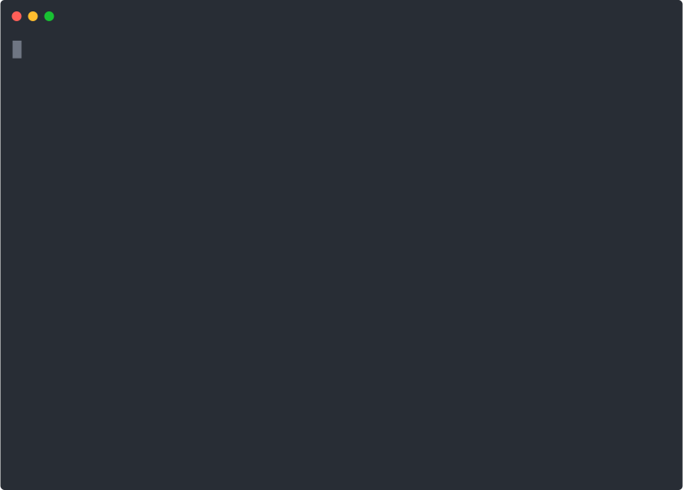

## Overview

This is an optional extra challenge to try if you finish the [Vocabulary Words](exercise_vocabulary.md) early. This re-uses some of the concepts we have already learned to create an animation of a car driving across our terminal. First we will learn another way to concatenate strings.

## Concatenating Strings Multiple Times

We've practiced concatenating (joining) multiple strings together using the `+` symbol.

```python
color = "blue"
print("My favorite color is " + color)
```

Another way of concatenating strings multiple times is by using the `*` symbol. 

```python
# both of these strings are the same
manual_line = "--------------------"
multiply_line = "-" * 20
```

## Printing A Car

In the [Bouncing Ball exercise](../../session2/classroom/exercise_ball.md) from Session 2, we used multi-line strings to represent the different frames of the bouncing balls. If we wanted to print a person driving a car we could do something similar: 

```python
car = """   -           __
 --          ~( @\   \ 
---   _________]_[__/_>________
     /  ____ \ <>     |  ____  \ 
    =\_/ __ \_\_______|_/ __ \__D
________(--)_____________(--)____"""

print(car)
```

Another way we can print this car is to split up the multi-line string into 6 different strings, one for each line: 

```python
car_0 = "   -           __"
car_1 = " --          ~( @\   \ "
car_2 = "---   _________]_[__/_>________"
car_3 = "     /  ____ \ <>     |  ____  \ "
car_4 = "    =\_/ __ \_\_______|_/ __ \__D"
car_5 = "________(--)_____________(--)____"

print(car_0)
print(car_1)
print(car_2)
print(car_3)
print(car_4)
print(car_5)
```

Even though this will produce the same output as the example using the multi-line string, you may be wondering **WHY** would we want to do it this way? It seems like a lot more work having to deal with 6 different strings?!?  *Hold that thought...*

## Making The Car Appear In a Different Spot 

Let's say we wanted to have the car appear 3 spaces further to the right. If we were using the single multi-line string variable, we'd have to do some fancy tricks to make this happen. By having 6 different strings, we just need to concatenate a few extra spaces when printing them. 

```python
print("   " + car_0)
print("   " + car_1)
print("   " + car_2)
print("   " + car_3)
print("   " + car_4)
print("   " + car_5)
```

What if we wanted to have the car appear at an arbitrary number of spaces to the right? We can use the trick we learned above to concatenate the string `" "` (a single space) multiple times. 

```python
spaces = " " * 3
print(spaces + car_0)
print(spaces + car_1)
print(spaces + car_2)
print(spaces + car_3)
print(spaces + car_4)
print(spaces + car_5)
```

Using the code here, we can now easily change `spaces` to be however long we want, and the car will be printed that many spaces to the right. 

## Pedal to the Metal!

Ok, let's put all of this together with some of our other tricks. 

1. Create a new file in VS Code called `moving_car.py` and copy the following code into it:
    ```python
    import time

    car_0 = "   -           __"
    car_1 = " --          ~( @\   \ "
    car_2 = "---   _________]_[__/_>________"
    car_3 = "     /  ____ \ <>     |  ____  \ "
    car_4 = "    =\_/ __ \_\_______|_/ __ \__D"
    car_5 = "________(--)_____________(--)____"
    ```
1. Add a `counter` variable set to `0` and create a `while` loop that will run while `counter` is less than `40`.
1. Inside the `while` loop, print our magic terminal clearing command:
    ```python
    print("\033[H\033[J")
    ```
1. Print the car as shown above, using the `counter` variable to print multiple spaces.  Try running the code now to make sure it runs, and see what it does. (**TIP:** If it looks like it's running forever or acting strangely press `Ctrl-C` (that's pressing the `Ctrl` and `C` keys at the same time) to stop the program!)
1. Make sure to add one to your `counter` inside the loop, and add a `time.sleep(<NUMBER-OF-SECONDS>)` so you can actually *see* the car move across the screen.
1. Run the code to make sure it runs, and see what it does. Experiment with different numbers for the `sleep` function to see what works best. Remember that you can provide decimal values (e.g. `.1` or `.25`)

<details>
<summary>
<b>Click here to see what the final program should look like...</b>
</summary>

</details>

## Extra Challenge: Bike Version

Some might say cars are cool, but bikes are where it's at! If that's you and your car is cruising smoothly across your terminal, here's one more challenge you can try with an extra twist. 

1. Create a new file in VS Code called `moving_bike.py` and copy the following code into it:
    ```python
    import time

    bike1_0 = "        __o"
    bike1_1 = "    _`\<,_"
    bike1_2 = "    (-)/ (-)"

    bike2_0 = "        __o"
    bike2_1 = "    _`\<,_"
    bike2_2 = "    (+) L(+)"
    ```
1. Write some code like you did in the `moving_car.py` program to make the variables `bike1_x` move across the screen.  *(Ignore the variables named `bike2_x` for now.)* Run the code to make sure it works as expected.
1. Update your code to alternate between printing the `bike1_x` and `bike2_x` versions of the bike, using an `if` statement to decide which version to print. You can do this one of two ways:

    - **With Variables :triangular_flag_on_post:**: You can add the following before your `while` loop: `flag = "one"`. Then inside the loop do something like `if flag == "one":` to print a specific version of the bike, and in the `else` clause print the other version of the bike. You'll need to update the value of the `flag` variable to `one` in the `else` clause, and to some other value in the first part of the `if` clause. 
    
    - **With Math :cold_sweat:**: The `%` operator in Python is the modulo operator - which returns the remainder of a division.  An even number divided by 2 will never have a remainder (or, the remainder will always be zero), so you could do something like `if counter % 2 == 0:` to print a specific version of the bike for even values of `counter`, and in the `else` clause print the other version of the bike.

<details>
<summary>
<b>Click here to see what the final program should look like...</b>
</summary>

</details>
