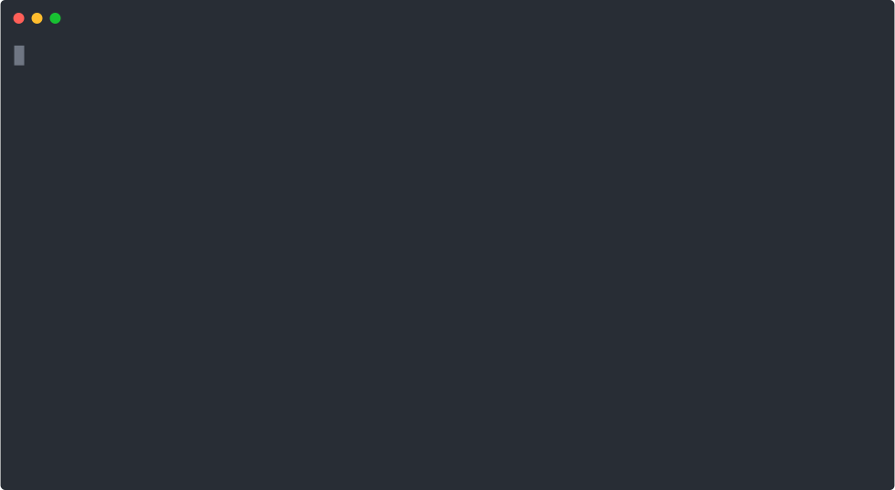

# Lightning Exercises

These lightning exercises are centered around taking an order at our favorite coffee shop. They use a combination of things we've done in previous exercises, as well as incorporating some features of Python that we've just learned about (specifically using _lists_). After we've worked through all of these, we should have a simple ordering system that asks for a customers name, prints a list of drinks our coffee shop can make, and then asks what drink the customer would like to order.

---

You should create a new Python file for these exercises. Do not overwrite the Python file from the previous lightning exercises.

> **TIP:** As you work through each exercise and are testing your code, you may want to add some extra `print()` statements to space out the different sections to make it easier to keep track of things.

## Exercise 1

1. Create a new directory within your `workspace` directory, and a Python file for the exercise. Remember to name things in such a way that you'll know what they are in a few weeks.
1. Write some code in the Python file that sets the name of the coffee shop in a variable called `shop_name` and prints a message like "__Coffee Shop Name__ Ordering System".

## Exercise 2

1. Customer service is important at our coffee shop, we need to know who is placing an order. Add some code that asks for the customer name and saves it in a variable called `customer_name`.
1. Using a _while_ loop, write code to force the user to enter something for their name (a blank customer name doesn't do us any good).
> **NOTE:** You can refer back to what you did in the [Session 2 Lightning Exercise](../../session2/classroom/lightning_exercises.md) for a refresher on how you've done this before.
1. Print a message like "Order is for __Customer__".

## Exercise 3

1. We can't make every type of coffee drink here, and we want to make sure the barista remembers what's actually on the menu. Create a _list_ variable called `drink_menu` with a list of the drinks that we can make. Whether you get creative or keep it simple, make sure there are at least 4 drinks on the menu.
1. We want to display this menu so we can tell the customer what they can order. Print a message that says "Drink Menu". Then using a _for_ loop, iterate over the `drink_menu` list, and print out each drink name.

## Exercise 4

1. It's time to take an order from our uncaffeinated customer. Print a message that says "Taking Order".
1. Add some code that asks what drink the customer would like to order and saves it in a variable called `drink_order`.
1. Print a message that says "__customer_name__ has ordered a __drink_order__".

## Exercise 5

1. Customers are sometimes more creative than our menu planners, if a "half-caff caramel macchiato with extra whip" is not part our menu, we shouldn't let a customer order it. Modify what you just wrote in [Exercise 4](#exercise-4) to add a _while_ loop that makes sure that `drink_order` is something that's in the `drink_menu` list. Your code should keep prompting to enter a drink order until something on the menu is provided.

*Whew - you did it - you deserve a coffee after all that after all that! We'll revisit this code and make a few more changes to it in our next session.*

<b>Click here to see what our coffee shop ordering service might look like...</b>

