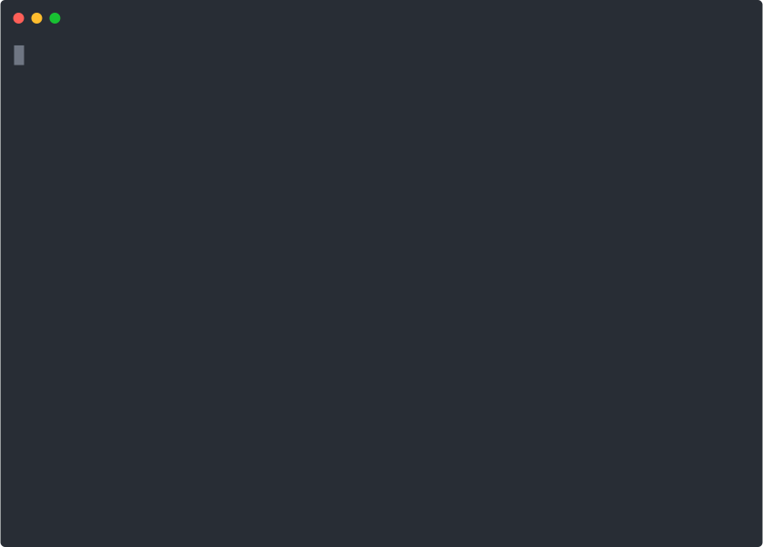

## Lightning Exercise

These are some lightning exercises to get some practice working with functions. We're going to build a simple library assistant to help us keep track of books that we like.

---

You should create a new Python file for these exercises. Do not overwrite the Python file from the previous lightning exercises.

> **TIP:** As you work through each exercise and are testing your code, you may want to add some extra `print()` statements to space out the different sections to make it easier to keep track of things.

## Exercise 1

1. Create a function called `welcome` that prints a welcome message like "Personal Library Assistant". This function should take no parameters, and will not return anything. Print a row of hashmarks (e.g. `########################################`) before and after the message.
    > **OPTIONAL:** You can use the `*` symbol from the Session 3 [Optional Challenge](../../session3/classroom/challenge.md) to print 40 `#` characters for the hashmark row.
1. Create a function called `main` at the top of the file (before the `welcome` function). This function should take no parameters, and will not return anything. Inside this function, call the `welcome` function.
1. Run your script now - you should not see anything happen. Let's fix that by adding a call to the `main` function at the end of the file. When you run it after adding that call you should see something like this:
    > ```
    > ########################################
    > Personal Library Assistant
    > ########################################

## Exercise 2

> **TIP:** Python will let us organize our functions (mostly) however we want, but it will be easier to update and maintain if we keep it organized like this as we continue adding more functions:
> ```python
> def main():
>    # code for main
>
> def welcome():
>    # code for welcome
>
> # add new functions here
>
> main()
> ```

1. Create a function called `get_books` that takes no parameters. Inside the function create an empty list variable called `books`.
1. Use the `input` function to prompt for the title of a book and save it in a variable named `book_title`.
1. Create a `while` loop that will run as long as `book_title` is not blank. Inside the `while` loop, `append` the `book_title` variable to the `books` list, and prompt for another book title.
    > In other words, we want to collect as many book titles as the user wants to enter. When they are done providing book titles, they'll just enter a blank line.
1. Outside of the `while` loop, use the `return` statement to return the `books` list variable.
1. In the `main` function, call the `get_books` function and assign the returned value to a new variable called `my_books`.
1. Using the `print` function, print a message like "The books are: " followed by the `my_books` variable.

## Exercise 3

1. Create a function called `get_ratings` that takes a single parameter called `books`. Inside the function create an empty list variable called `ratings`.
1. Using a `for` loop, iterate through each `book_title` in the `books` parameter. Use the `input` function to prompt for a rating of that book on a scale from 1-5 and save it in a variable named `rating`. You'll need to print the name of the book so your user knows what book they are rating.
    > **TIP:** The prompt should look something like this:
    > ```
    > How do you rate 'Treasure Island' (1-5)?
    > ```
1. Use the `append` function to add the `rating` variable to the `ratings` list.
1. Outside of the `for` loop, use the `return` statement to return the `ratings` list.
1. In the `main` function, call the `get_ratings` function, passing the `my_books` variable as the function parameter, and assign the returned value to a new variable called `my_ratings`.
1. Using the `print` function, print a message like "The ratings are: " followed by the `my_ratings` variable.

## Exercise 4

*At this point our program is keeping track of the things we want it to (book titles and ratings), but the way it prints this info is ... not ideal. Let's make that nicer.*

1. Create a function called `print_library` that takes 2 parameters: `books` and `ratings`.
1. Inside the function create a variable called `num_books` that is equal to the length of the `books` parameter.
1. Print a message like "My Library: # books" using the `num_books` variable to indicate the number of books in your library. Print a row of hashmarks (e.g. `########################################`) before and after the message (optionally using the `*` symbol again). It should look something like this:
    > ```
    > ########################################
    > My Library: 5 books
    > ########################################
1. Create a `for` loop with a `book_index` that uses the `range` function with `num_books`. Inside the loop, use the `book_index` to print a book title (from the `books` parameter/variable) and corresponding rating (from the `ratings` parameter/variable).
    > **TIP:** See the [Session 4 prework](../../session4/prework/for_loop.md#get-a-list-index-with-range-and-len) for a refresher on how to use `for` loops like this.
1. In the `main` function call the `print_library` function, passing the `my_books` and `my_ratings` variables as the 2 parameters. Remove the `print` statements that you've added in previous steps.

<details>
<summary>
<b>Click to see what this might look like when you run it ...</b>
</summary>



</details>

<details>
<summary>
<b>Click to see a reminder of how your code should be organized at this point ...</b>
</summary>

```python
def main():
    welcome()
    my_books = get_books()
    my_ratings = get_ratings(my_books)
    print_library(my_books, my_ratings)

def welcome():
    # code for welcome

def get_books():
    # code for get_books

def get_ratings(books):
    # code for get_ratings

def print_library(books, ratings):
    # code for print_library

main()


```
</details>

---

## Some Takeaways

Functions can be a bit of a mind bender, so don't worry if you're still trying to understand how they work. Here's a quick refresher on some of the things you read about in the [prework](../prework/functions.md) and have now put into practice here.

- *Functions are just a named container of code.* The code that you've been learning how to write without functions is the exact same code you can put in functions.
- Function **parameters** are passed into functions. *Parameters are just like the variables that you've been using* - instead of declaring them somewhere the code, they're declared when you define them as part of the function definition. Both things named `books` in this example are a variable that can be used in the same way:
    ```python
    # VARIABLE:
    # this declares a variable named 'books'
    books = []

    # PARAMETER:
    def get_ratings(books):
        # this function has a parameter (variable) named 'books'
    ```
- Functions can **return** data that you can put into other variables. Printing variables or other text does not return anything (even though you can see it when you run it). *You must use the `return` statement to return a value from a function.*

In addition to those concepts, we saw some useful patterns for keeping our code organized:

- When you first started learning how to write code (ya know, way back like a week and a half ago), you just created a file and started writing your code at the top of the file and kept adding more. Now that you've added functions to your toolkit, it pays to keep your code tidy as you go. The pattern we've used here is one that's commonly used by software developers across many different programming languages. Start with a `main` function at the top of the file, followed by all other functions, and then ending the file with a call to the `main` function. If you adopt this pattern now you'll be in good company.
- You'll also notice we didn't write any functions *within* other functions. Make sure each function you write stands alone.
- When writing code that uses functions, you should keep all of your code contained in those functions. [Importing](../prework/import_random.md) other Python libraries is a notable exception to this rule (you'll always want those at the top of your file, outside of functions), but otherwise keep your code in those functions.

Lastly, keep on working through these examples and asking questions. You'll get it!
